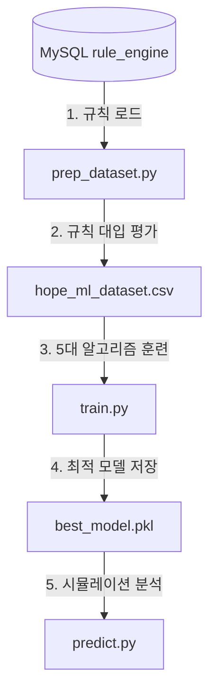

# 🤖 ML_GUIDE: 머신러닝 예측 엔진 가이드

이 파일은 머신러닝 폴더(`ml_predict`) 내부의 머신러닝 파이프라인 작동 원리를 상세히 설명하는 가이드라인입니다.

---

## 💡 아주 쉬운 비유로 이해하기

이 시스템은 대학교 입학 과정과 똑같습니다.

1. **내신/수능 최저학력기준 검증 (룰 엔진 - MySQL)**
   * "수능 3등급 이내일 것", "무주택자일 것"처럼 자격 요건을 시험합니다.
   * 기준에 단 1점이라도 미달하면 **100% 무조건 탈락**시킵니다.
   * 요건을 충족하면 일단 '적격 지원자'가 됩니다.

2. **최종 정원 제한 경쟁 (머신러닝 - `best_model.pkl`)**
   * 최저 기준을 통과한 지원자가 1,000명인데 뽑는 인원은 10명뿐이라면? **점수가 높은 순으로 잘라야 합니다.**
   * 다른 지원자들의 점수 분포와 과거 합격 컷(Cutline)을 학습하여, **"내가 2순위 8점인데 합격할 수 있을까?"**에 대한 **확률적 성공률(Odds)**을 시뮬레이션해 줍니다.

> 룰 엔진은 **"내가 지원 자격이 되는가?"**를 보고, 머신러닝은 **"지원 자격이 되는 사람들 중에 내가 실제로 붙을 수 있는가?"**를 예측합니다.

---

## ⚙️ 폴더 내 파일 및 구동 아키텍처

이 폴더 안은 총 3가지 단계로 유기적으로 연결되어 작동합니다.



### 1단계: 데이터셋 생성기 (`prep_dataset.py`)
* **하는 일:** 가상의 지원자 2,000명의 상세 프로필을 랜덤 생성한 뒤, **MySQL에서 실시간으로 188개 규칙을 긁어와** 이들을 하나씩 평가합니다.
* **결과물:** 필수 요건 충족 및 가점 점수를 구하고 최종 커트라인을 뚫었는지 정답지(`Pass` = 0 또는 1)를 마킹하여 [`hope_ml_dataset.csv`](file:///c:/Users/hi/Desktop/rule-engine-playground-2/data/processed/hope_ml_dataset.csv) 파일로 저장합니다.

### 2단계: 다중 분류기 훈련 (`train.py`)
* **하는 일:** 생성된 정답지(CSV)를 바탕으로 사이킷런(Scikit-Learn)의 5대 대표 알고리즘(의사결정나무, 랜덤포레스트, Gradient Boosting 등)을 훈련시킵니다.
* **결과물:** 전처리(원핫 인코딩, 표준 스케일링) 장치와 가장 똑똑하게 판정하는 모델을 결합한 통합 파이프라인인 [`best_model.pkl`](file:///c:/Users/hi/Desktop/rule-engine-playground-2/ml_predict/best_model.pkl) 파일로 저장합니다.

### 3단계: 합격 확률 예측기 (`predict.py`)
* **하는 일:** 저장된 최적 모델(`best_model.pkl`)을 불러와서, 실제 지원자의 상세 프로필(Facts)을 집어넣고 경쟁 합격 가능성을 시뮬레이션합니다.
* **결과물:** 지원자별로 분석 보고서를 출력합니다.
  * *예: "2순위 자산 초과자 B의 합격 확률: 0.76% (탈락 예상)"*
  * *예: "1순위 기초수급자 A의 합격 확률: 93.14% (합격 예상)"*

---

## 🚀 파이프라인 구동 방법 (실행 명령어)

프로젝트 루트 폴더 혹은 터미널에서 다음 순서대로 실행하시면 머신러닝 엔진이 처음부터 끝까지 완전하게 구동됩니다.

```bash
# 1. MySQL 규칙 기반의 데이터셋 생성
python ml_predict/prep_dataset.py

# 2. 데이터셋을 학습하여 최적의 AI 모델 피클 생성
python ml_predict/train.py

# 3. 새로운 모의 지원자에 대한 합격 확률 시뮬레이션 실행
python ml_predict/predict.py
```
